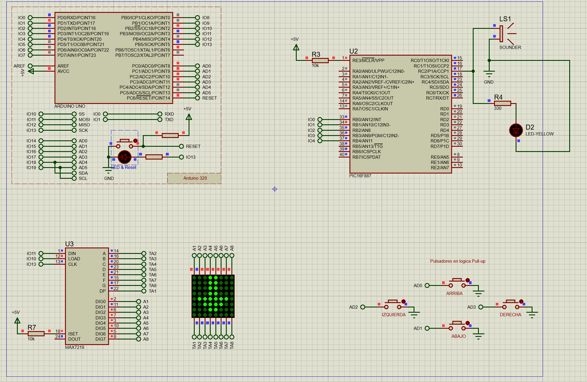

# Tarea 2 - Sistemas Embebidos

<p align="center">
  
</p>

## Proyecto: Simon Matrix

**Simon Matrix** es un juego interactivo tipo “Simón Dice” desarrollado como parte de la Tarea 2 de la asignatura Sistemas Embebidos. El sistema utiliza dos microcontroladores: un **ATmega328P**, encargado de la lógica principal del juego, la lectura de pulsadores y el control de una matriz LED 8x8; y un **PIC16F887**, encargado de la reproducción de sonidos mediante un sounder.

El juego cuenta con tres niveles de dificultad: fácil, medio y difícil. En cada nivel, el sistema muestra una secuencia visual en la matriz LED 8x8 y el usuario debe repetirla correctamente mediante pulsadores. A medida que aumenta el nivel, la secuencia se vuelve más larga y la velocidad de visualización aumenta, incrementando la dificultad del juego.

---

## Objetivo General

Desarrollar un sistema de juego interactivo de tres niveles de dificultad mediante el uso de dos microcontroladores, integrando salidas visuales en una matriz LED 8x8 controlada por el ATmega328P, salidas auditivas mediante un sounder controlado por el PIC16F887 y entradas mediante pulsadores, empleando comunicación paralela entre ambos dispositivos y simulando el funcionamiento completo en Proteus.

---

## Objetivos Específicos

- Diseñar la lógica de un juego interactivo tipo Simón Dice con tres niveles de dificultad.
- Implementar el control de una matriz LED 8x8 mediante el microcontrolador ATmega328P y el controlador MAX7219.
- Programar la lectura de pulsadores como entradas digitales para la interacción del usuario con el juego.
- Establecer una comunicación paralela entre el ATmega328P y el PIC16F887 para sincronizar eventos visuales y sonoros.
- Programar el PIC16F887 para reproducir sonidos asociados a eventos del juego, como inicio, acierto, error, cambio de nivel y victoria.
- Simular el sistema completo en Proteus para verificar el funcionamiento de la matriz LED, los pulsadores, la comunicación entre microcontroladores y el buzzer.
- Documentar el proceso de diseño, programación y simulación del sistema.

---

## Descripción General del Funcionamiento

El juego inicia mostrando el nivel actual en la matriz LED 8x8. Luego, el ATmega328P genera una secuencia de símbolos representados mediante flechas: arriba, abajo, izquierda y derecha. Cada símbolo corresponde a un pulsador físico conectado al microcontrolador.

El usuario debe observar la secuencia mostrada en la matriz y repetirla presionando los botones en el mismo orden. Si la respuesta es correcta, el sistema emite un sonido de acierto y avanza en el juego. Si el usuario se equivoca, se muestra una señal de error en la matriz y el PIC16F887 reproduce un sonido de error.

Cuando el jugador completa correctamente la secuencia de un nivel, el sistema muestra un símbolo de victoria y reproduce una melodía. Posteriormente, el juego avanza al siguiente nivel. Al completar el tercer nivel, el sistema puede reiniciarse desde el nivel 1.

---

## Niveles de Dificultad

| Nivel | Dificultad | Características |
|---|---|---|
| Nivel 1 | Fácil | Secuencia corta de 3 símbolos y velocidad lenta |
| Nivel 2 | Medio | Secuencia de 5 símbolos y velocidad intermedia |
| Nivel 3 | Difícil | Secuencia de 7 símbolos y velocidad rápida |

Cada nivel se muestra brevemente en la matriz LED 8x8 mediante los indicadores **L1**, **L2** y **L3**.

---

## Microcontroladores Utilizados

### ATmega328P

El ATmega328P funciona como el microcontrolador principal del sistema. Sus funciones son:

- Controlar la lógica del juego.
- Generar las secuencias visuales.
- Leer los pulsadores del usuario.
- Controlar la matriz LED 8x8 mediante el MAX7219.
- Enviar comandos al PIC16F887 mediante comunicación paralela.

### PIC16F887

El PIC16F887 funciona como módulo de sonido. Sus funciones son:

- Recibir comandos enviados desde el ATmega328P.
- Interpretar los comandos recibidos.
- Activar el buzzer.
- Reproducir sonidos diferentes según el evento del juego.

---

## Comunicación entre Microcontroladores

La comunicación entre el ATmega328P y el PIC16F887 se realiza mediante una conexión paralela de 4 bits de datos y una señal de sincronización llamada **STROBE**.

| ATmega328P | PIC16F887 | Función |
|---|---|---|
| PD0 | RB0 | D0 |
| PD1 | RB1 | D1 |
| PD2 | RB2 | D2 |
| PD3 | RB3 | D3 |
| PD4 | RB4 | STROBE |

El ATmega328P coloca el comando en los pines **PD0-PD3** y luego activa brevemente la señal **STROBE** en **PD4**. Cuando el PIC16F887 detecta la señal STROBE en **RB4**, lee los datos presentes en **RB0-RB3** y ejecuta el sonido correspondiente.

---

## Tabla de Comandos

| Comando | Evento del Juego | Acción del PIC16F887 |
|---|---|---|
| 1 | Inicio del juego | Melodía de inicio |
| 2 | Nivel 1 | Sonido de nivel fácil |
| 3 | Nivel 2 | Sonido de nivel medio |
| 4 | Nivel 3 | Sonido de nivel difícil |
| 5 | Respuesta correcta | Beep de acierto |
| 6 | Error del usuario | Beep de error |
| 7 | Victoria | Melodía de victoria |

---

## Componentes Principales

- ATmega328P
- PIC16F887
- Matriz LED 8x8
- Controlador MAX7219
- Pulsadores
- Buzzer o speaker
- Resistencias
- Fuente de 5 V
- Conexiones de tierra común
- Proteus 8 Professional
- Visual Studio Code
- PlatformIO
- MikroC PRO for PIC

---

## Estructura del Repositorio

```text
Tarea2-Sistemas-Embebidos-Simon-Matrix/

├── ATmega-328P/
│   ├── main.cpp
│   ├── platformio.ini
│
├── PIC16F887/
│   ├── SIMON_DICE_PIC.c
│
├── Proteus/
│   ├── simon_dice_c.pdsprj
│
├── Video/
│   └── funcionamiento_simulacion.mp4
│
├── PDF/
│   └── Informe_Tarea_2_Sistemas_Embebidos.pdf
│
└── README.md
